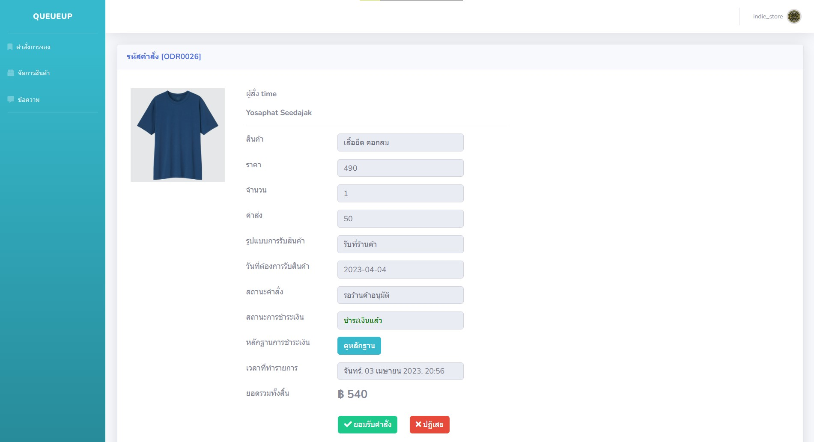

# Product Booking System

This project involves creating a website for convenient product booking and sales. Users can reserve products from different stores, choose delivery or pickup options, 
and also sell their own products on the platform without any fees. It facilitates easy purchasing and transaction management for both buyers and sellers.

# Features

## User Registration and Authentication
- Users can create an account and log in securely to access the platform's features.
- Password hashing and salting ensure user data is kept safe.
## Product Listings
- Sellers can list their products with detailed information such as title, description, price, and available quantity.
- Products are categorized and displayed for easy navigation.
## Product Reservation
- Buyers can reserve products they wish to purchase.
- Users can select between delivery or pickup options based on their preferences.
## User-to-User Messaging
- Buyers and sellers can communicate through an integrated messaging system.
- This feature allows users to clarify product details, negotiate prices, or discuss pickup/delivery arrangements.
## Transaction Management
- Users can track their reservations and transactions.
- Sellers can manage their listings, view reservation requests, and mark reservations as completed.

## Technologies Used

- HTML
- CSS
- Bootstrap
- JavaScript
- PHP
- SQL (for database management)

---

